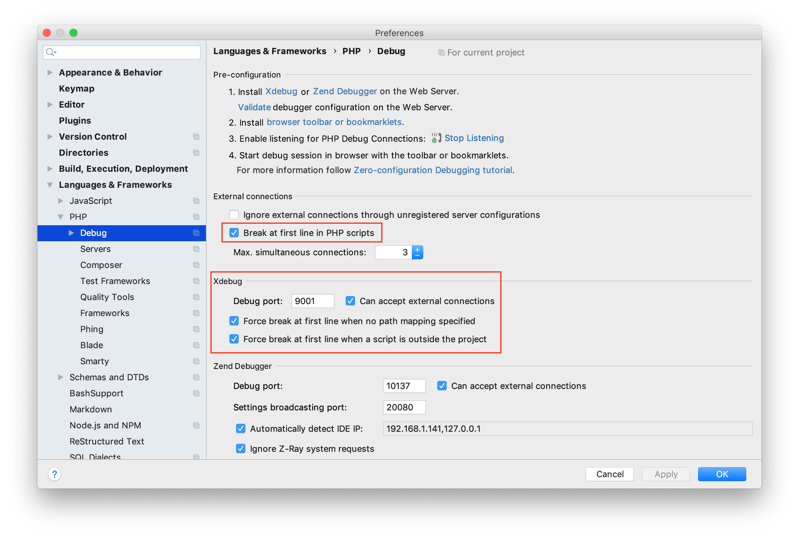
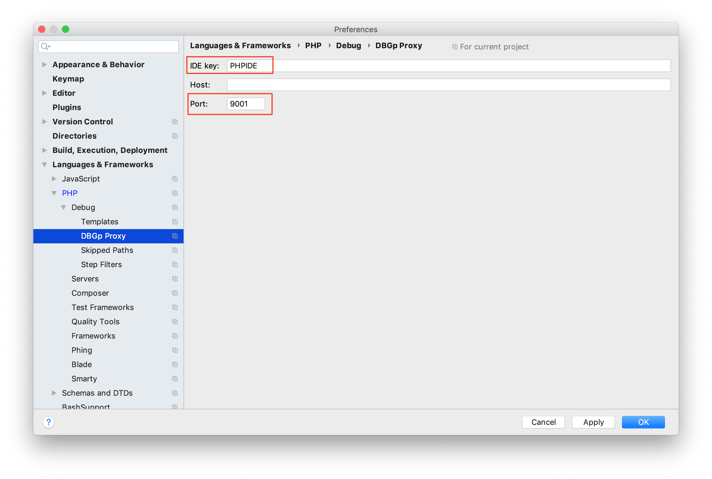
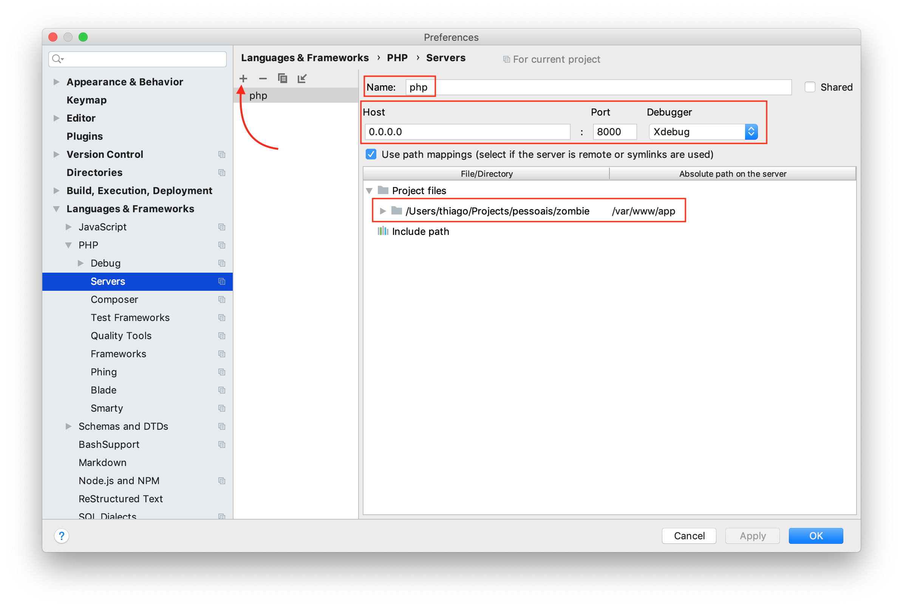
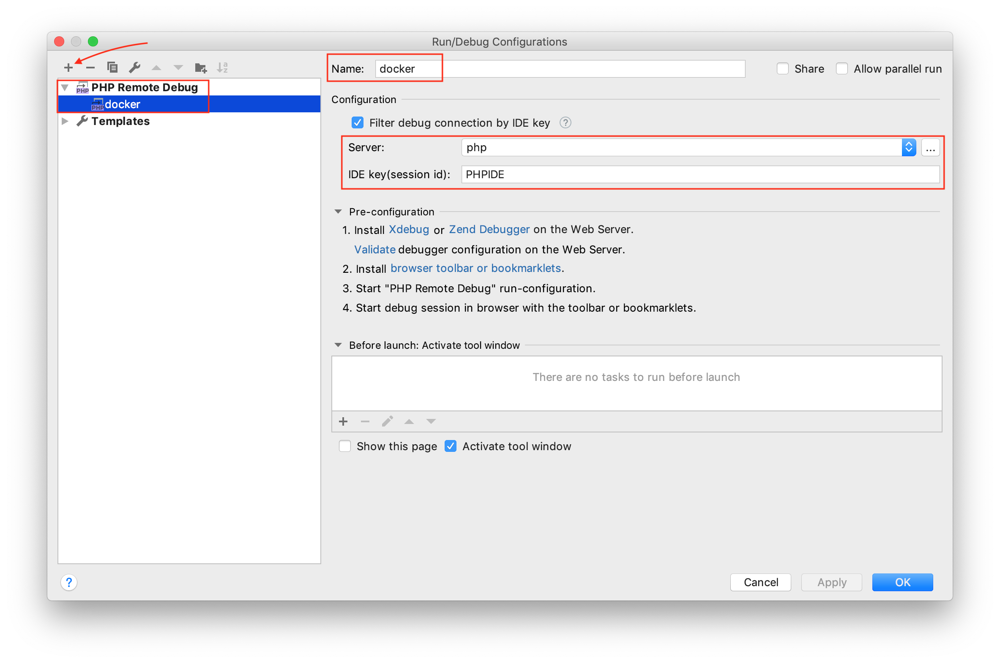

# XDebug

You can configure Xdebug in some PHP editors and IDEs.

## PHPStorm 2019.1+

1. Open `Preferences > Languages & Frameworks > PHP > Debug` and define the settings marked in red as following:

2. Open `Preferences > Languages & Frameworks > PHP > Debug > DBGp Proxy` and configure it as following:

3. Open `Preferences > Languages & Frameworks > PHP > Servers` and add a new server clicking on `+` and then filling the 
settings as following:

Note: If you use another server name rather than `php` you must create a `.env` with `XDEBUG_IDE_SERVERNAME=your-name`. 
See [an example in .env.dist](../.env.dist).
4. Now open `Run > Edit Configurations` and add a new configuration clicking on `+` and selecting `PHP Remote Debug`. 
Fill the settings as following:

5. It's time to start a debugging session 🎉🎉. Whenever you want to start a session, click on 
`Start Listening for PHP Debug Connections`. To stop, click again. See it in action:

